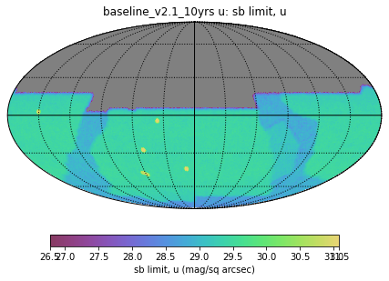
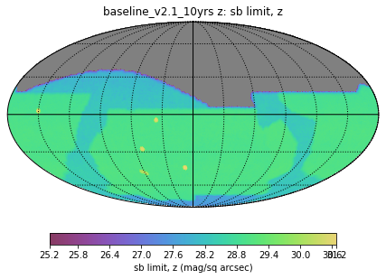

..
  Technote content.

  See https://developer.lsst.io/restructuredtext/style.html
  for a guide to reStructuredText writing.

  Do not put the title, authors or other metadata in this document;
  those are automatically added.

  Use the following syntax for sections:

  Sections
  ========

  and

  Subsections
  -----------

  and

  Subsubsections
  ^^^^^^^^^^^^^^

  To add images, add the image file (png, svg or jpeg preferred) to the
  _static/ directory. The reST syntax for adding the image is

  .. figure:: /_static/filename.ext
     :name: fig-label

     Caption text.

   Run: ``make html`` and ``open _build/html/index.html`` to preview your work.
   See the README at https://github.com/lsst-sqre/lsst-technote-bootstrap or
   this repo's README for more info.

   Feel free to delete this instructional comment.

:tocdepth: 1

.. Please do not modify tocdepth; will be fixed when a new Sphinx theme is shipped.

.. sectnum::

.. TODO: Delete the note below before merging new content to the main branch.

.. note::

   Creating a metric to estimate coadded limiting surface brightness magnitudes.

.. Add content here.
.. Do not include the document title (it's automatically added from metadata.yaml).

Survey Strategy and Surface Brightness Limits
---------------------------------------------
The Vera C. Rubin Observatory's Legacy Survey of Space and Time (LSST) has a wide variety of science goals, beyond the primary core science drivers. As part of the definition of the details of the survey strategy, the LSST and the community are working together to maximize science return across a wide cross-section of these goals, with the guidance of the LSST Survey Cadence Optimization Committee (the [SCOC](https://www.lsst.org/content/charge-survey-cadence-optimization-committee-scoc)). 

Questions that arise in defining the survey strategy, when considering observations in multiple bandpasses over large areas of sky, is how the observations should be distributed between filters and if there should be different balances in different parts of the sky. There are many science interests that must be considered in this choice, including photometric redshift determination and galaxy detection. One aspect that is relevant for this tech note, and was discussed in detail in the 2018 Cadence White Paper ['LSST Cadence Optimization White Paper in Support of Observations of Unresolved Tidal Stellar Streams in Galaxies beyond the Local Group'](https://arxiv.org/abs/1812.04897) is the possibility of detecting low surface brightness features in coadded images from the survey. This cadence note made some estimates of the LSST coadded surface brightness limits based on the total number of visits available, but with simulations of the pointing history of the survey available as well as multiple simulations investigating the effects of varying the filter balance, it makes sense to create an estimate of the potential surface brightness limits coming from those pointing histories. 

While the actual surface brightness limits achieved by the survey will depend on details of the data processing, especially flat fielding and sky subtraction, a basic estimate based on gaussian errors and the simulated properties (sky brightness, seeing, read noise, etc) of each image is useful. This has now been coded into a metric within the LSST Metric Analysis Framework ([MAF](https://rubin-sim.lsst.io/rs_maf/index.html#) which is part of the Rubin simulation package `rubin_sim`(https://github.com/lsst/rubin_sim), so we can compare the effect of varying survey strategies and filter balances. This work was done in coordination with the LSST Galaxies Science Collaboration Low Surface Brightness group, and the estimates generated by the metric generally agree with estimates from scaling limits from existing surface brightness limits from extant surveys such as Stripe 82.

Limiting Surface Brightness
---------------------------

Throughout we are assuming Guassian propagation of error. The number of photons detected in a single pixel from an object of constant surface brightness :math:`\mu`:

.. math::
   N_{photons, source} = 10^{\frac{\mu_{source} - Z_p + kX}{-2.5}} * A_{pix} * t_{exp}

where :math:`Z_p` is the telescope instrumental zeropoint, :math:`k` is the atmospheric extinction term, :math:`X` is airmass, :math:`A_{pix}` is the area of a pixel (e.g., pixscale squared), and :math:`t_{exp}` is the exposure time.

The number of photons from the sky background will then be (note we drop the airmass extinction):

.. math::
   N_{photons, sky} = 10^{\frac{\mu_{sky} - Z_p}{-2.5}} * A_{pix} * t_{exp}

So the total SNR for a single pixel should be:

.. math::
   \frac{S}{N} = \frac{N_{photons, source}}{\sqrt{N_{photons, source} + N_{photons, sky} + RN^2}}

where RN is the readnoise in electrons.

Source limited
===============

In the source-limit, for a single pixel

.. math::
   SNR/pix = \sqrt{N_{photons,source}}

and then the final total SNR after combining independent pixels will be

.. math::
   SNR = \sqrt{N_{pix}}\sqrt{N_{photons,source}}

If I work this out on paper I end up with

.. math::
   \mu_{source} = -1.25\log_{10}{SNR} + \frac{1.25}{2}\log_{10}{N_{pix}A_{pix}t_{exp}} + Z_p - kX

Background Limited
==================

.. math::
   SNR/pix = \frac{N_{photons,source}}{\sqrt{N_{photons, sky}}}

then the total SNR:

.. math::
   SNR = \sqrt{N_{pix}} \frac{N_{photons,source}}{\sqrt{N_{photons, sky}}}

.. math::
   N_{photons,source}^2 = \frac{SNR^2 N_{photons, sky}}{N_{pix}}

.. math::
   A_{pix}^2 t_{exp}^2 10^{\frac{\mu_{source} - Z_p + kX}{-1.25}} = \frac{SNR^2A_{pix}t_{exp}10^{\frac{\mu_{sky} - Z_p}{-2.5}}}{N_{pix}}

.. math::
   10^{\frac{\mu_{source} - Z_p + kX}{-1.25}} = \frac{SNR^2 10^{\frac{\mu_{sky} - Z_p}{-2.5}}}{ A_{pix} t_{exp} N_{pix}}

.. math::
   \mu_{source} - Z_p + kX =-1.25 \log_{10}{\frac{SNR^2}{ A_{pix} t_{exp} N_{pix}}} + 0.5(\mu_{sky} -Z_p)

.. math::
   \mu_{source} =-1.25 \log_{10}{\frac{SNR^2}{A_{pix} t_{exp} N_{pix}}} + 0.5\mu_{sky} +0.5Z_p - kX

Readnoise Limited
==================

.. math::
   SNR/pix = \frac{N_{photons,source}}{RN}

.. math::
   \frac{SNR RN}{\sqrt{N_{pix}}}  = 10^{\frac{\mu_{source} - Z_p + kX}{-2.5}} * A_{pix} * t_{exp}

.. math::
   \mu_{source} = -2.5\log_{10} \frac{SNR RN}{A_{pix} t_{exp} \sqrt{N_{pix}}} + Z_p -kX

If one is dealing with multiple snaps in an exposure, the RN should be the effective readnoise, i.e., the single frame readnoise multiplied by the square root of the number of snaps.

Combining limiting magnitudes
=============================

A quick justification for how to combine limiting magnitudes, which is relatively straight forward but can be helpful to see written out.

We define :math:`m_N` as the magnitude where the SNR = N (N=5 for a the commonly quoted 5-sigma point source limiting magnitude, N=3 is often used for surface brightness measurements, as some examples)

so:

.. math::
   \frac{flux_N}{Noise} = N

Let's look at a flux ratio with some arbitrary mag :math:`m`

.. math::
   m-m_N = -2.5 \log_{10}{\frac{flux}{flux_N}} 

SNR at that new magnitude is

.. math::
   \frac{flux}{Noise} = SNR

substitute in

.. math::
   m-m_N = -2.5 \log_{10}{\frac{SNR * Noise}{N*Noise}} 

Solve for the SNR of an arbitrary mag :math:`m` given :math:`m_N`:

.. math::
   SNR = N 10^{-0.4(m-m_N)}

Now, if we have a bunch of limiting magnitudes :math:`m_{5,i}`, what is the final SNR if we coadd them? The SNR for some fiducial mag :math:`m` in each frame will be

.. math::
   SNR_i = N 10^{-0.4(m-m_{N,i})}

SNR adds in quadrature

.. math::
   SNR_{coadd} = \sqrt{\sum_i SNR_i^2}

.. math::
   SNR_{coadd} = \sqrt{\sum_i N^2 10^{-0.8(m-m_{N,i})}}

from above we know:

.. math::
   m-m_{N,coadd} = -2.5\log_{10} \frac{SNR_{coadd}}{N}

subsitute in :math:`SNR_{coadd}` from above:

.. math::
   -m_{N,coadd} = -2.5\log_{10} \frac{\sqrt{\sum_i N^2 10^{-0.8(m-m_{N,i})}}}{N} - m

.. math::
   m_{N,coadd} = 2.5\log_{10} \sqrt{\sum_i 10^{-0.8(m-m_{N,i})}} + m

We've just been carrying :math:`m` around as an arbitray magnitude, so I think we can set :math:`m=0` and simplify to

.. math::
   m_{N,coadd} = 1.25\log_{10} \sum_i 10^{0.8m_{N,i}}

So there we go, if we have lots of images with unique N-sigma depth values, we can compute what the N-sigma depth would be if they were coadded.

Results
=======

These equations are have been made available as a Metric within `MAF <https://github.com/lsst/rubin_sim/blob/main/rubin_sim/maf/metrics/surfbMetric.py>`__, and the results for a recent baseline are computed in this `notebook <https://github.com/lsst-sims/smtn-016/blob/main/notebook/Surface_brightness_example.ipynb>`__ as a helpful guide.

By default, we compute the 3-sigma limiting depth over a 100 square arcsecond patch of sky.

.. list-table:: Median surface brightness limits
   :widths: 25 25 
   :header-rows: 1

   * - filter
     - surface brightness limit (mag/sq arcsec)
   * - u
     - 29.4
   * - g
     - 30.3
   * - r
     - 30.3
   * - i
     - 29.7
   * - z
     - 28.9
   * - y
     - 28.1

.. .. rubric:: References

.. Make in-text citations with: :cite:`bibkey`.

.. .. bibliography:: local.bib lsstbib/books.bib lsstbib/lsst.bib lsstbib/lsst-dm.bib lsstbib/refs.bib lsstbib/refs_ads.bib
..    :style: lsst_aa
